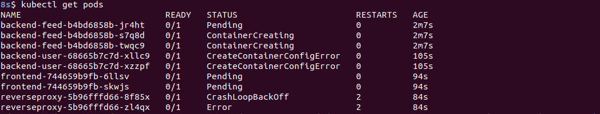
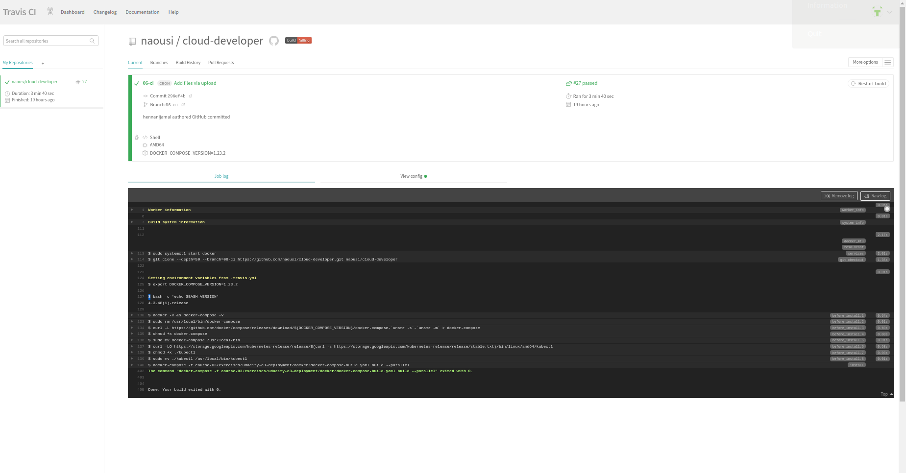
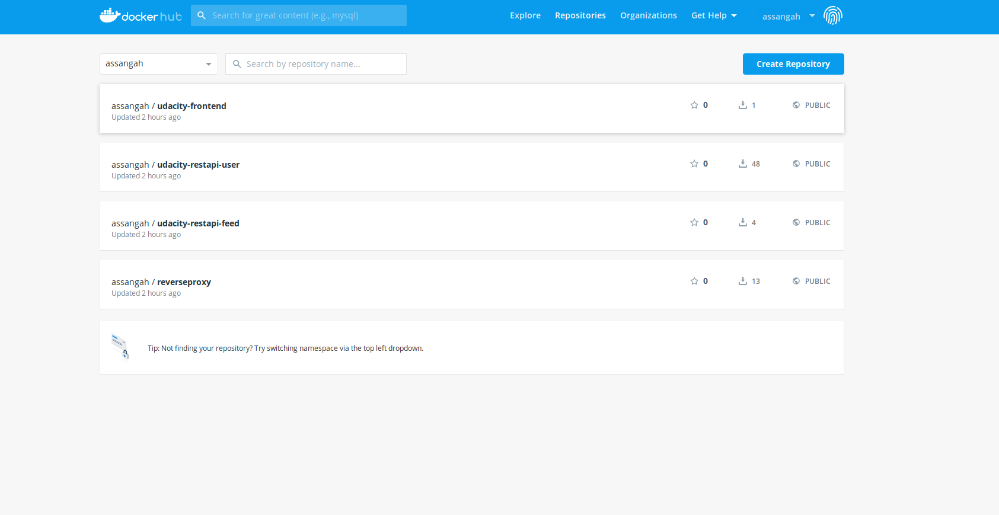

# Refactor Udagram app into Microservices and Deploy

## Second Submission note
Screenshot of the `kubectl get pod`

## How to Run Project

Clone repo:

` git clone -b 06-ci https://github.com/naoussi/cloud-developer.git`

- Install dependencies for the frontend, 
    - navigate to the directory _cloud-developer/course-03/exercises/udacity-c3-frontend_
    - Run `npm install` to install dependencies
    - If you don't haver ionic setup on your system, run `npm install -g ionic`
    - You can run a test on the frontend with the command `npm test`
    - You can startup the front end application locally with the command `ionic serve`

- Install dependencies of the feed restapi.
    - navigate to the directory _cloud-developer/course-03/exercises/udacity-c3-resapi-feed_
    - Run `npm install` to install dependencies
    - Run `npm run dev` to run server locally

- Install dependencies of the user restapi.
    - navigate to the directory _cloud-developer/course-03/exercises/udacity-c3-resapi-user_
    - Run `npm install` to install dependencies
    - Run`npm run dev` to run server locally

- I created the `prod` branch which will hold the final deployment to production.

## Travis Build Screenshot

## Setup Docker Environment

You'll need to install docker https://docs.docker.com/install/.

To create, deploy and run the docker images, I simply used the `docker-compose up` command.

- Navigate to the directory _cloud-developer/course03/exercises/udacity-c3-deployement/docker_

- Open a new terminal within the above mentioned docker directory and run:

    1. Build the images: `docker-compose -f docker-compose-build.yaml build --parallel`
    2. Push the images: `docker-compose -f docker-compose-build.yaml push`
    3. Run the container: `docker-compose up`

### Run App on Docker
- Open on the browers the link `localhost:8100`

[docker hub](https://hub.docker.com/u/naoussi) 

## Setup kubernetes clusters

Install and setup kubeone and terraform

- navigate to the directory _cloud-developer/course03/exercises/udacity-c3-deployement/k8s_

### Creating AWS infrastructure
- Open a new terminal from this directory and run the following command:
    1. Initialize terraform: `terraform init`
    2. `terraform plan`
    3. `terraform apply`
    4. `terraform output -json > tf.json`
  
### Installing kubernetes
- Verify kubeone installation: `kubeone config print --full`
- Copy configuration: `kubeone config print > config.yaml`
- Install kubernetes cluster: `kubeone install config.yaml --tfjson tf.json`
- Get Kubeconfig file: `kubectl --kubeconfig=<cluster_name>-kubeconfig`
- export the KUBECONFIG variable environment variable: `export KUBECONFIG=$PWD/<cluster_name>-kubeconfig` 

### Deploying to kuberbetes
- `kubectl apply -f backend-feed-deployment.yaml`
- `kubectl apply -f backend-user-deployment.yaml`
- `kubectl apply -f frontend-deployment.yaml`
- `kubectl apply -f reverseproxy-deployment.yaml`

### Adding configurations
- `kubectl apply -f aws-secret.yaml`
- `kubectl apply -f env-configmap.yaml`
- `kubectl apply -f env-secret.yaml`

### Run Kubernetes application on local machine

- Verify pods: kubectl get pod
- Run reverseproxy server: `kubectl port-forward pod/reverseproxy-xxxxx-xx 8080:8080`
- Run frontend: `pod/frontend-xxxxxx-xxxx 8100:8100`

### Deploy services on Kubernetes
- `kubectl apply -f backend-feed-service.yaml`
- `kubectl apply -f backend-user-service.yaml`
- `kubectl apply -f frontend-service.yaml`
- `kubectl apply -f reverseproxy-service.yaml`

## Monitoring
Screenshot of application on Amazon Cloudwatch:

## References
- [Kubeone](https://github.com/kubermatic/kubeone)
- [Kubernetes clusters on AWS using KubeOne](https://www.loodse.com/blog/2019-07-25-running-ha-kubernetes/)
